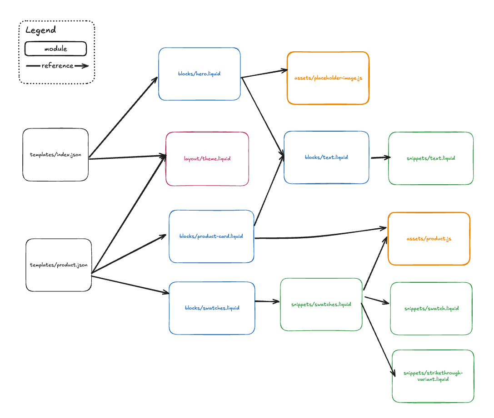

# How it works

## Table of contents

1. [What it looks like](#what-it-looks-like)
1. [Concepts overview](#concepts-overview)
2. [Algorithm overview](#algorithm-overview)

## What it looks like

An app graph looks a bit like this:



It's a web of modules and links between them.

## Concepts

A **Graph** is a set of Nodes and Edges.

An **App Graph** is a set of *Modules* (nodes) and *References* (edges) defined by an array of *Entry Points*. It has these properties:
- `rootUri` - root of the app, e.g. `file:/path/to/app`
- `entryPoints` - array of modules that define the app (pages and layouts)
- `modules` - all the modules in the app indexed by URI

A **Module** is an object that represents an app file. It has these properties:
- `uri` - module identifier, e.g. `file:/path/to/app/views/partials/file.liquid`
- `type` - e.g. `liquid`, `json`, `javascript`, `css`.
- `kind` - e.g. `layout`, `partial`, `page`.
- `references` - array of *References* that point to this module.
- `dependencies` - array of *References* that this module depends on.

A **Reference** is an object that defines a link between two modules. It has these properties:
- `source` - a `uri` and `range` that defines which module depends on an other and _where_ in the source file,
- `target` - a `uri` and `range` that defines which module is being dependended on and optionally what is being depended on in that file,
- `type` - one of the following:
  - `direct` - the file can't exist without the other, e.g. ``
  - `indirect` - the file loosely depends on the other, but not explicitly.


## Algorithm overview

To build the graph, we _traverse_ each module in the set of entry points.

When we _traverse_ a module, we do the following:
- if the module was already visited, we return early, else
- we extract dependencies from the module's AST, then
- we _bind_ the module with its dependent modules, then
- we _traverse_ the dependent modules (it's a recursive algorithm).

When we _bind_ a parent module with a child module, we do the following:
- we add the child module to the parent's dependencies,
- we add the parent module to the child's references

In pseudo code, it looks a bit like this:
```
INPUT rootUri
OUTPUT graph

FUNCTION buildGraph(rootUri, entryPoints):
  SET graph = { rootUri, entryPoints, modules: {} }
  FOR module in entryPoints:
    CALL traverse(module, graph)
  ENDFOR
ENDFUNCTION

FUNCTION traverse(module, graph):
  IF graph.modules has module:
    RETURN -- nothing to do, already visited
  ENDIF

  -- signal that this module has been visited
  SET graph.modules[module.uri] = module

  EXTRACT references FROM module by visiting the AST

  FOR reference in references:
    dependency = getModule(reference.target.uri)
    CALL bind(module, dependency, reference)
    CALL traverse(dependency, graph)
  ENDFOR
ENDFUNCTION

FUNCTION bind(parent, child, reference)
  parent.dependencies.push(reference)
  child.references.push(reference)
ENDFUNCTION
```
